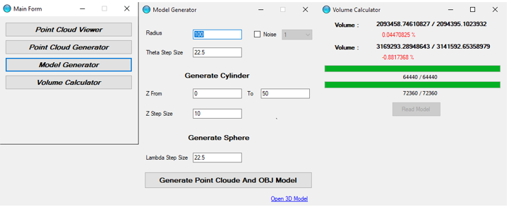

# Point-cloud-based-volume-measurement
<h2>Point Cloud Base 3D Model Generation and Volume Calculation Program</h2>

Design a solution for calculating the volume of oil tanks using 3D cloud point data this includes implementation of necessary algorithms for calculating the volume.

